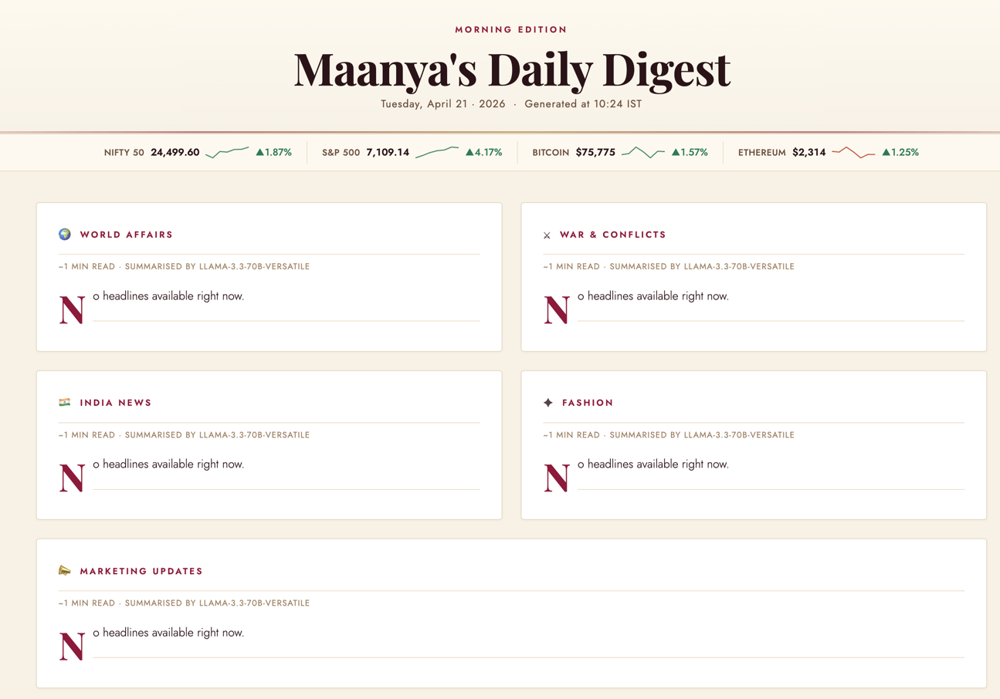
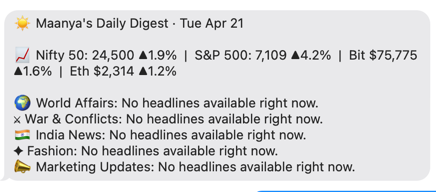

## Prototype for personalized RSS feed generation

### Todos
* Might want to shift away from direct LLM calls and collate results from trusted api's (free ones hopefully)
* Use groq only for summarization. llama should be fine